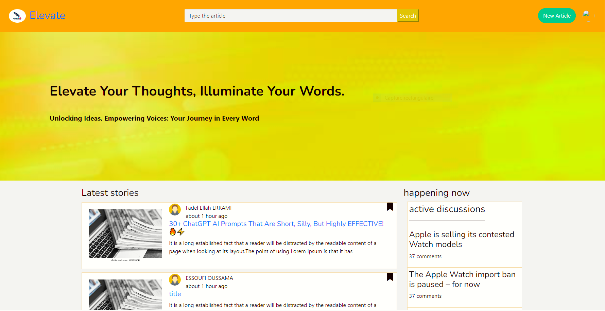
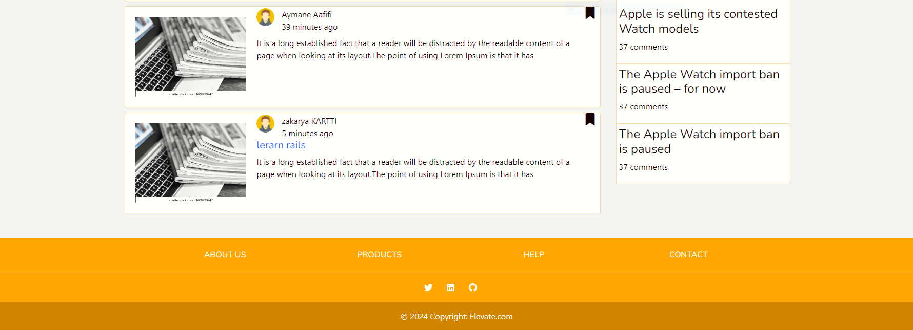
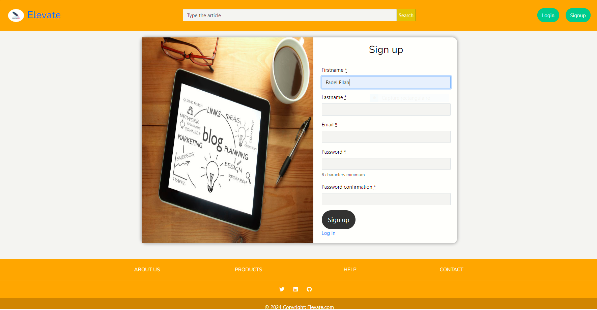
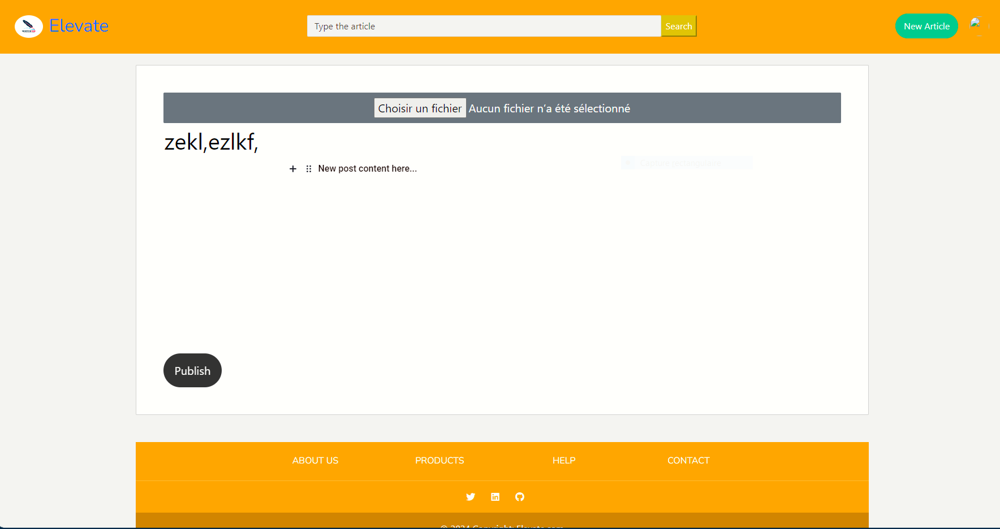
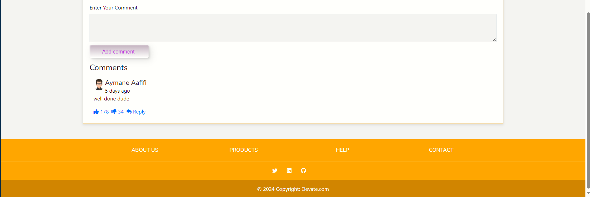
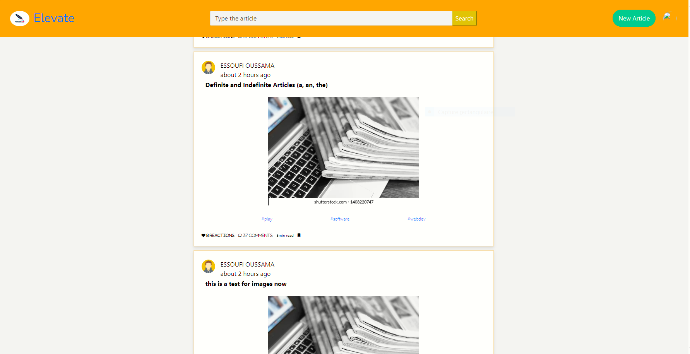
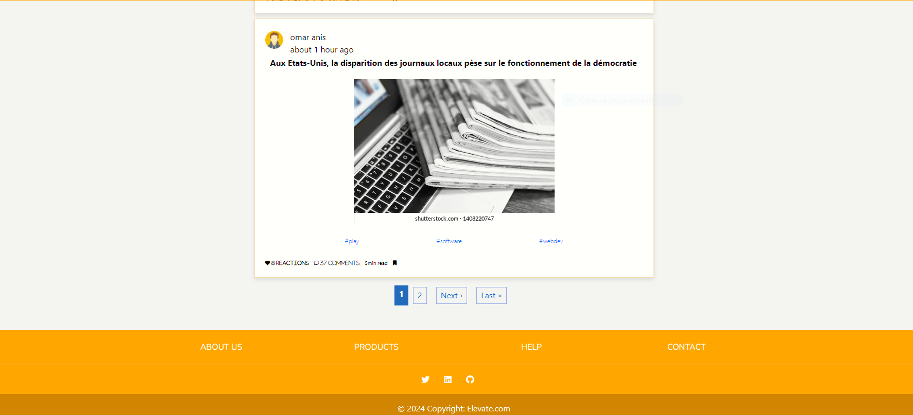

# Create a blog using runy on rails

Index page

<figure><figcaption></figcaption></figure>

<figure><figcaption></figcaption></figure>

Sign up page

<figure><figcaption></figcaption></figure>

Login page

<figure><figcaption></figcaption></figure>

New post Page

<figure><figcaption></figcaption></figure>

Show page

<figure><figcaption></figcaption></figure>

Posts page

<figure><figcaption></figcaption></figure>

<figure><figcaption></figcaption></figure>

Profile page&#x20;

<figure><figcaption></figcaption></figure>

Edit profile page&#x20;

<figure><figcaption></figcaption></figure>

You can visit our blog : [https://blog-team-f0c017e85842.herokuapp.com/](https://blog-team-f0c017e85842.herokuapp.com/)
